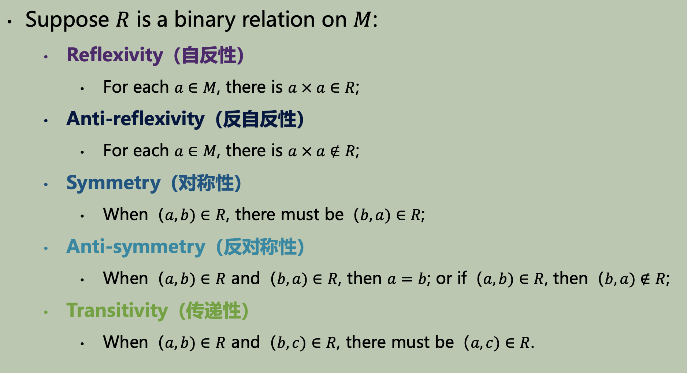
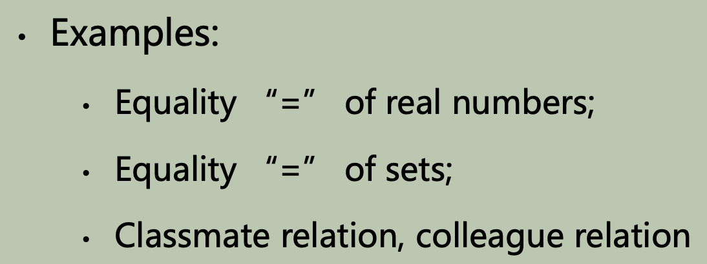
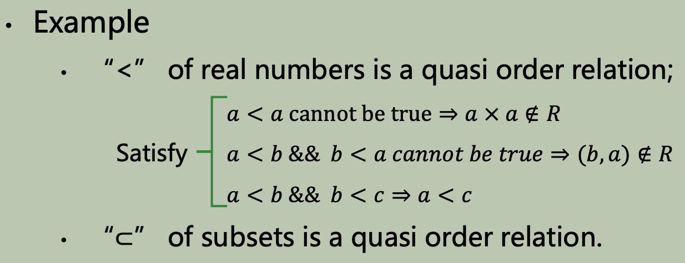
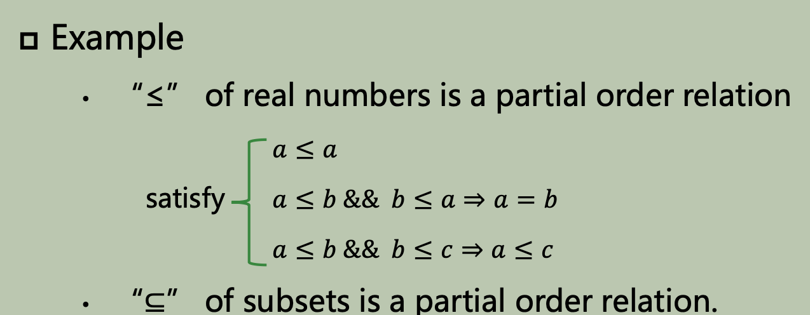
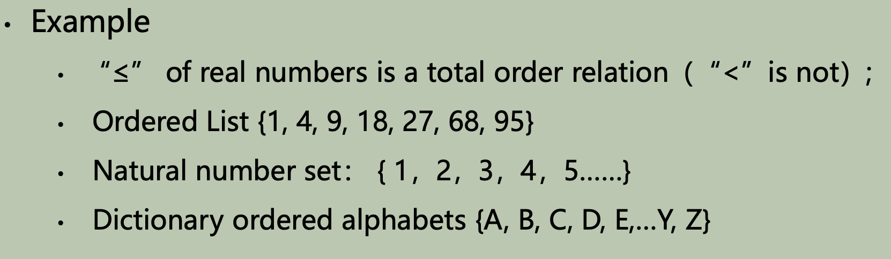
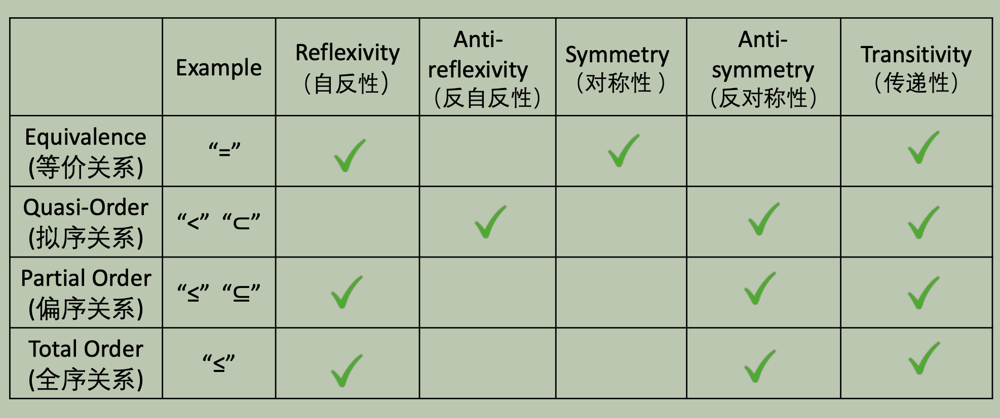
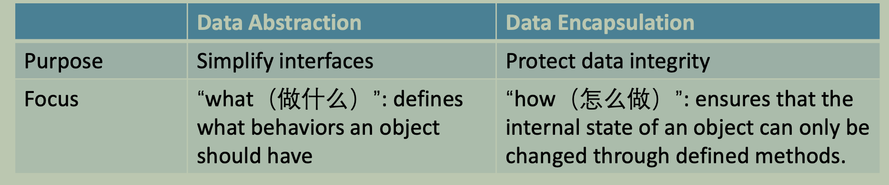
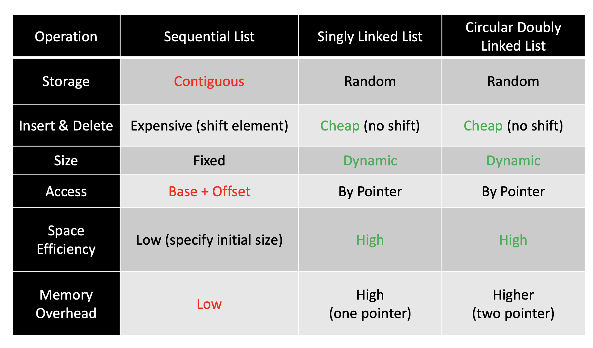

# L1: Linear List

## Basic Concepts of Data Structures

### Simple definition of data structure

- Data structure:
  - Relations between data
    - Binary relationship
  - Data storage structure
  - Operations on data

### Porperties of Binary Relationship



### Kinds of Relationships

- [x] Equivalence Relation
- Reflexivity
- Symmetry
- Transitivity

- [x] Quasi-Order Relation
- Anti-reflexivity
- Anti-symmetry
- Transitivity

- [x] Partial Order Relation
- Reflexivity
- Anti-symmetry
- Transitivity

- [x] Total Order Relation
- Partial Order Relation
- **Comparability**

- [x] Summary


## Abstract Data Type

### Key Characteristics

- [x] Data Abstraction: hiding the complex implementation details,allowing them to interact with the data through a simplified interface
- [x] Data Encapsulation: involves bundling the data (attributes) and the methods (functions) that operate on the data into a single unit, typically a class
- [x] Comparison


### Description of Abstract Data Type

```cpp
// Abstract Data Type
ADT name{
    Data object: <Definition of data object>
    Data relation: <Definition of data relation>
    Basic operations: <Definition of basic operations>
    Name of basic operation(parameter list)
    Initial condition: <Description of initial condition>
    Result: <Description of result>
}ADT name
```

- Advantages of ADT
  - Program structures are clear, easy to expand, easy to maintain without losing efficiency;
  - Greatly increases the reusability of software
  - Improves the data security in the programs

## Linear List

### Definition

>A finite sequence of n data elements with the
same properties

- Two storage type: sequential list and linked list
- A **data element** may include **multiple items**, thus it is also called **record**
- n: length of linear list, n=0 called **empty list**

- [x] Elements **in the same linear list** must have the same properties ***Homogeneous***
  - [x] Reason
    >It's practical: It's the only way a simple array can work efficiently in memory.
    It's logical: The main purpose of a list is to manage a collection of the same kind of item.

### Types of Linear List

See implementation of [LinkList](./LinkList.cpp), [SqList](./SqList.cpp) and [C2LinkList](./C2LinkList.cpp)


