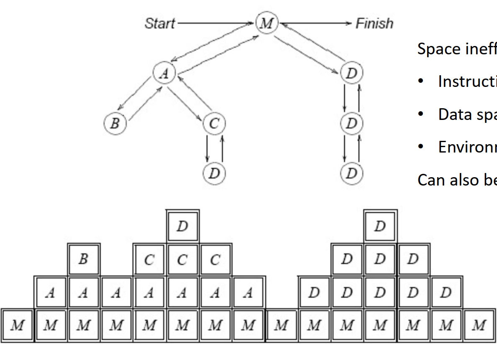
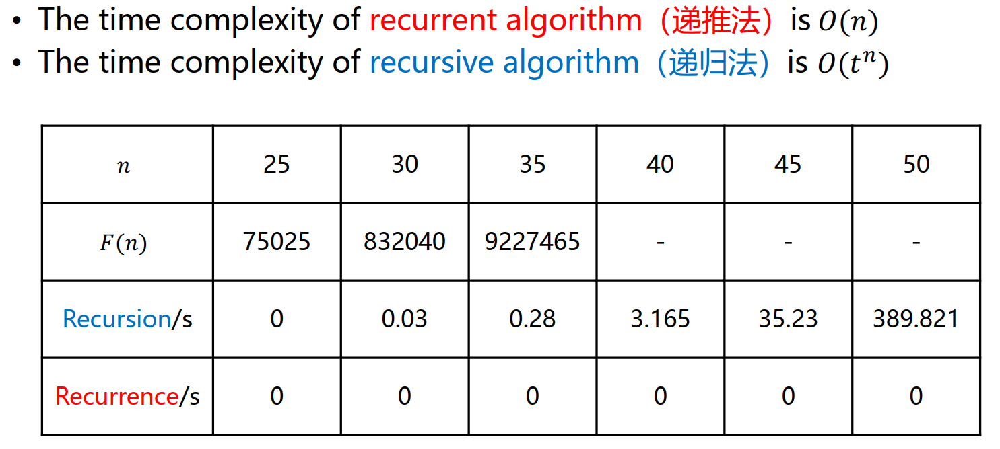

# L2: Stack & Recursion

## Stack

### Concept

- A kind of **linear structure**
- Insertion and deletion are only allowed to conducted from one end
- Follow **LIFO** rules


>**LIFO: Last In First Out
FILO: First in Last out**

### Implementation

- [x] [Sequential Stack](./SqStack.cpp)
- Time complexity for `push` and `pop`: $O(1)$
  
  

- Fixed size at initialization: ***Stack Overflow!***
- The **space utilization efficiency** is **low**
- [x] [Linked Stack](./LinkedStack.cpp)
- Time complexity for `push` and `pop`: $O(1)$
  
  
- Generally ***no stack overflow***
- The space utilization efficiency is **high**

- [x] Comparison
  

### Application

#### Brackets balance check

- 2 rules: **matched** and in **correct order**
- Steps:
  - If is an opening bracket, `{`, `[` or `(`, `push` to stack
  - If is a closed bracket, `}`, `]` or `)`, `pop` from stack

  

#### Base conversion

- $K=\lfloor N\div d \rfloor\times d+N \mod d$


#### Expression evaluation

Evaluate Postfix expression by stack:

- Scan the postfix expression from left to right
- If is a number, `push`
- If is an operator, `pop` **two numbers and calculate by the operator,
push the result into stack**
- The last remaining element in the stack is the result

## Recursion

### Examples

- Factorial Evaluation

    ```c
    int factorial( int n ）
    {
        if（n == 0） return 1;
        else return n * factorial(n - 1);
    }
    ```

- Greatest Common Divisor

    ```c
    int gcd(m, n）
    {
        int r = m % n;
        if（r != 0） return gcd(n, r);
        else
        return n;
    }
    ```

- Fibonacci Sequence

    ```c
    long Fib( long n ）
    {
        if（ n <= 1 ） return 1;
        else
        return Fib(n - 1） + Fib(n - 2);
    }
    ```

- Tower of Hanoi
    For Tower of Hanoi problem with $n$ disks, suppose the total number
    of moves is $m(n)$, then

    $$m(n)=\begin{cases}0&n=0\\2m(n-1)+1&n>0&&\end{cases}$$

### Elimination

#### Need

Function Invoking and Recursion



- Space inefficient due to
  - Instruction space
  - Data space
  - Environment space
- Can also be inefficient in time

Improve efficiency by ***eliminating recursion***

#### One-way Recursion

- [x] Special case: ***Tail Recursion***
    In a recursive program, there is only one recursive statement, and it is at the end of the function

    ```c
    /*example of tail recursion*/
    void recfunc(int A[], int n）
    {
        if（ n >= 0 ）
        {
            cout << A[n] << “ ”;
            n--;
            recfunc（ A, n );
        }
    }
    ```

- [x] One-way Recursion
  - There is no relationship between the parameters of each recursive call
statement
  - These recursive call statements are all at the end of the
recursive algorithm
  - Use recurrent algorithm to eliminate recursion in Fibonacci

    ```c
    long Fib_Iter（long n）
    {
        if（n <= 1） return n;
        long twoback = 0, oneback = 1, Current;
        for（int i = 2; i <= n; i++）
        {
            /*** Key Modification ***/
            Current = twoback + oneback;
            twoback = oneback;
            oneback = Current;
        }
        return Current;
    }
    ```

#### Comparison



***Conclusion: Recurrent algorithm performs better***
