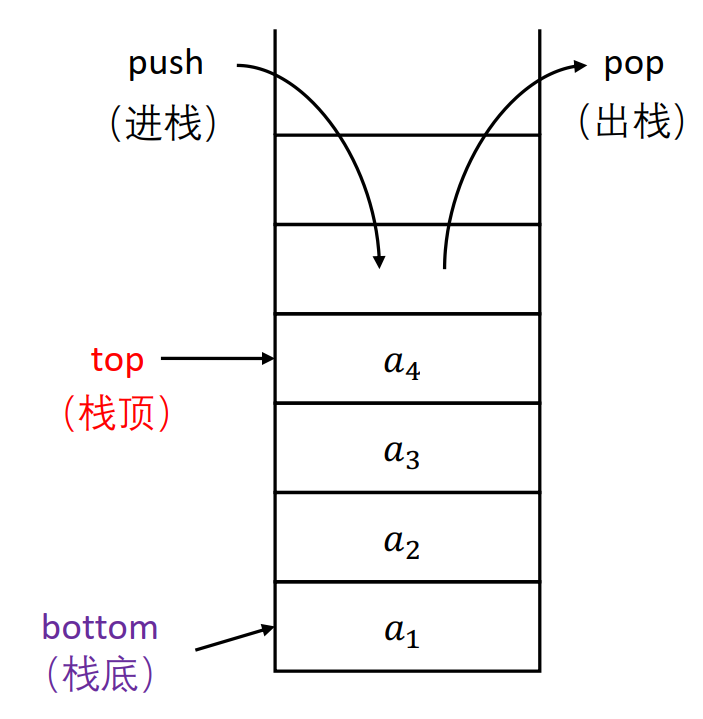
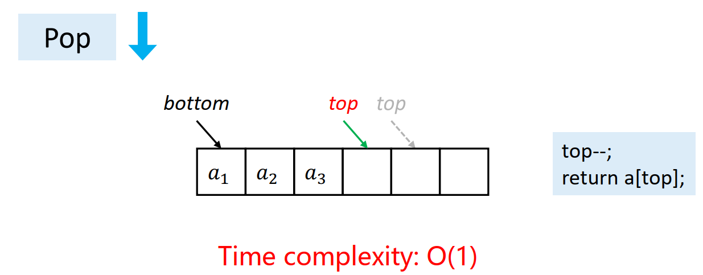
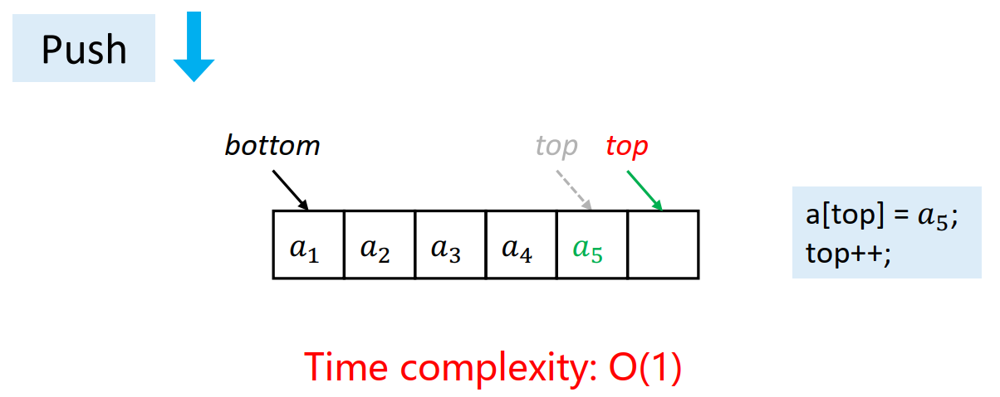
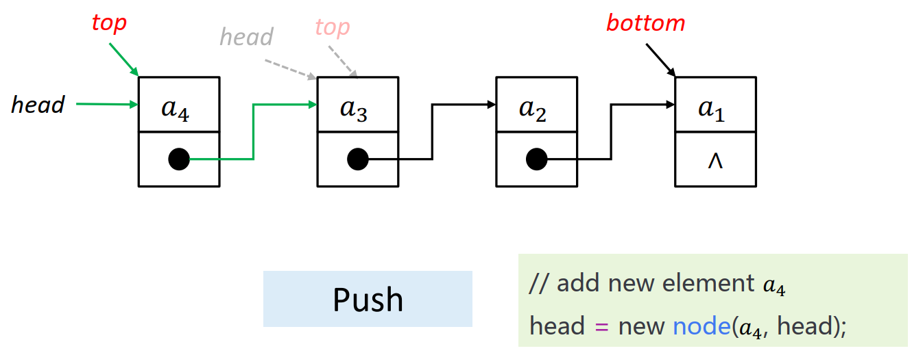
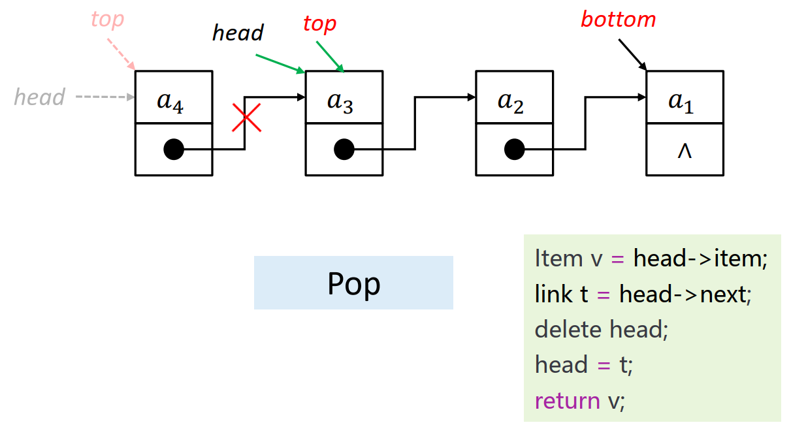
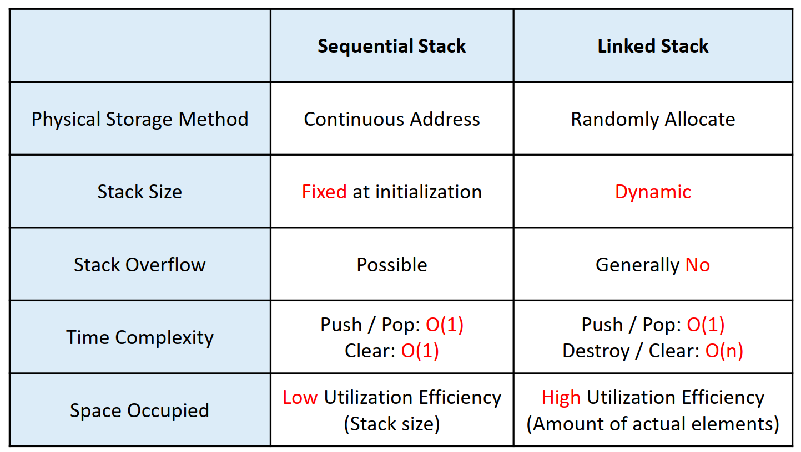
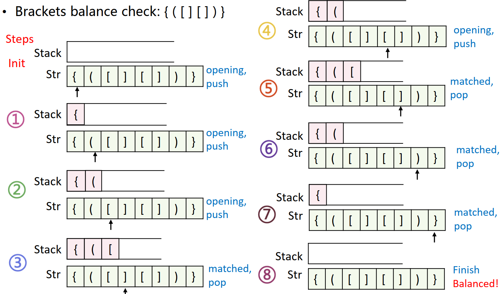
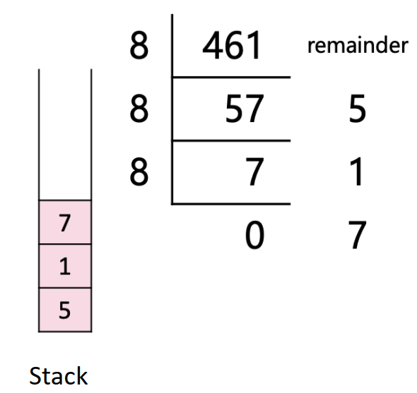

# L2: Stack & Recursion

## Stack

### Concept

- A kind of **linear structure**
- Insertion and deletion are only allowed to conducted from one end
- Follow **LIFO** rules

>**LIFO: Last In First Out
FILO: First in Last out**

### Implementation

- [x] [Sequential Stack](./SqStack.cpp)
- Time complexity for `push` and `pop`: $O(1)$
  
  

- Fixed size at initialization: ***Stack Overflow!***
- The **space utilization efficiency** is **low**
- [x] [Linked Stack](./LinkedStack.cpp)
- Time complexity for `push` and `pop`: $O(1)$
  
  
- Generally ***no stack overflow***
- The space utilization efficiency is **high**

- [x] Comparison
  

### Application

#### Brackets balance check

- 2 rules: **matched** and in **correct order**
- Steps:
  - If is an opening bracket, `{`, `[` or `(`, `push` to stack
  - If is a closed bracket, `}`, `]` or `)`, `pop` from stack
  

#### Base conversion

- $K=\lfloor N\div d \rfloor\times d+N \mod d$

#### Expression evaluation

Evaluate Postfix expression by stack:

- Scan the postfix expression from left to right
- If is a number, `push`
- If is an operator, `pop` **two numbers and calculate by the operator,
push the result into stack**
- The last remaining element in the stack is the result

## Recursion
