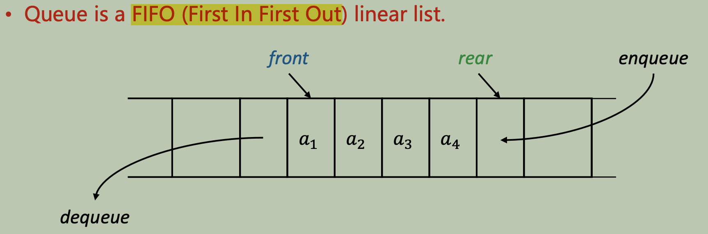
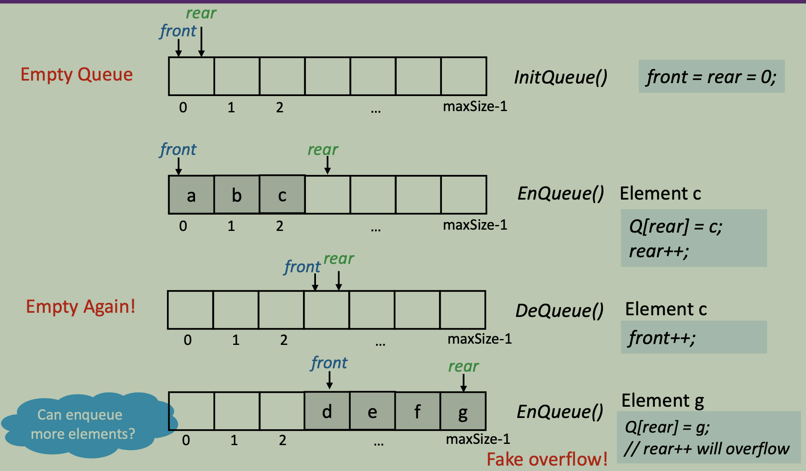
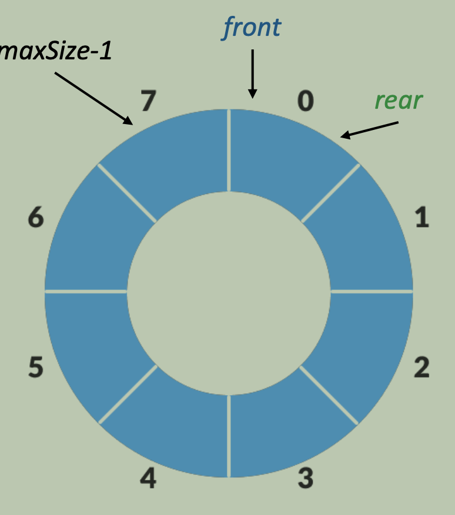
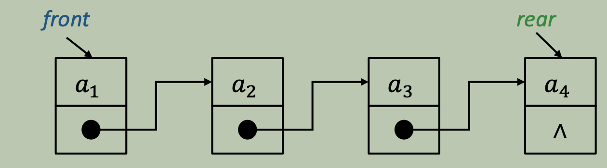
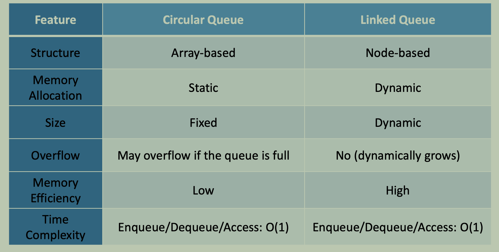

# Queue

## Concept

Queue is a data structure only allows **insertion** from **one certain end** while **deletion** from **the other end**



Elements in a queue enqueue and dequeue as the same order $a_1, a_2, ..., a_n$

## Common Operations

- Enqueue: Insert an element to the rear of the queue
```cpp
// EnQueue(Q,&e)
Q[rear] = e;
rear++;
```

- Dequeue: Remove an element from the front of the queue
```cpp
// DeQueue(Q,&e)
e = Q[front];
front++;
```

- [x] [Sequential Implementation](./ArrayQueue.cpp) bring the problem of ***fake overflow*** when `rear` reaches the end of the array but there are ***still empty spaces*** in front of `front`
    
    

### Circular Queue

- [Extended version](./CircularArrayQueue.cpp) of the sequential queue to solve the ***fake overflow problem***

    

- Implemented by `mod`
  - dequeue: `front = (front + 1) % maxSize`
  - enqueue: `rear = (rear + 1) % maxSize`
  - theNumberOfElements: `(rear - front + maxSize) % maxSize`

- Method to distinguish between **empty** and **full** queue
  - [x] Leave one space empty:
  - Queue is empty when `front == rear`
  - Queue is full when `(rear + 1) % maxSize == front`
  - [x] Set a status signal:
  - if a dequeue lead to `front == rear`, set `tag = 0` (empty)
  - if an enqueue lead to `front == rear`, set `tag = 1` (full)
  - else, normal
  - [x] Set a queue length variable
  - `+1` when enqueue, `-1` when dequeue 

### Linked Queue



- [x] Dynamic size. No problem of ***overflow*** when enqueuing


