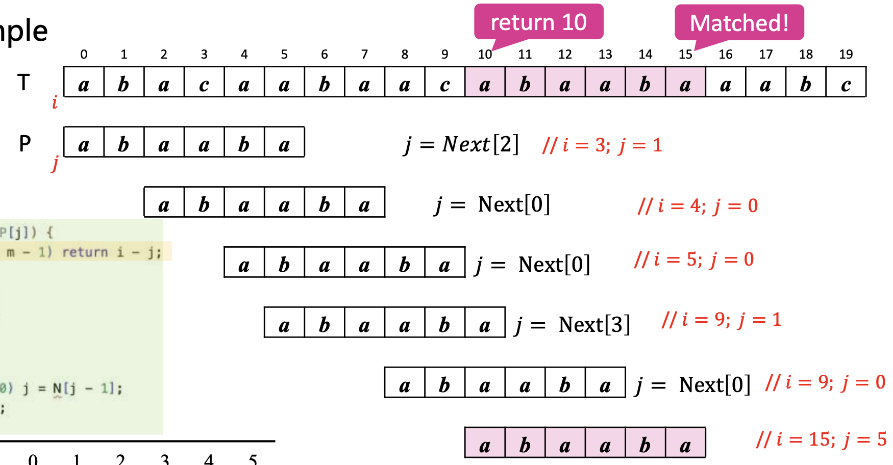

# String

## Concept

- A string is a character sequence with a **limited length**, or a linear list whose elements are \_characters
- SubString and main String
  - The position of the substring: Index of the **first character** in the main string.
- String Storage
  - Fixed-length sequencial storage:
    - Predefine the maximum length of the string.
    - Truncate string if exceeds the fixed length.
  - Variable-length sequencial storage:
    - Use a special character (e.g. `'\0'`) to mark the end of the string.
    - It avoids truncation and improves the utilization of storage space

## Operations

- [x] Minimum Operation set
- StrAssign(S, T): Assign string T to S
- StrCopy(S, T): Copy string T to S
- StrCompare(S, T): Compare strings S and T
- StrLength(S): Return the length of string S
- StrCat(S, T): Concatenate strings S and T
- SubString(Sub, S, pos, len): Get the substring Sub of string S starting from position pos with length len
- [x] Additional Operations can be implemented using the minimum operation set

## String Matching

See implementation in [StringMatchTest.cpp](./StringMatchTest.cpp)

### Brute Force (BF) Algorithm

- Time Complexity: $O(mn)$
- Low Efficiency, suitable for **small-large** (small pattern, large target string) problems

  ```cpp
  int BruteForceMatch(char *T, char *P){
      int n = strlen(T); //Calculate the length of target string T
      int m = strlen(P); //Calculate the length of pattern string P
      O(n-m+1)
      int i, j;
      for(i=0;i<=n-m;i++){ j = 0;
      while( j<m && T[i+j] == P[j]) j++; //Try positions of target string one by one
      if(j == m)
      return i; return -1; //Comparison fails
      //Compare with pattern string
      O(m)
      //Comparison succeeds at i
      }
  }
  ```

### Knuth-Morris-Pratt (KMP) Algorithm

- Main Idea: 2 steps

  - Step1: Build a **_Next_** table
    - Decide **_how to move pattern string_** in KMP algorithm if not matches
  - Step2: Match Pattern with target string
    - If matches，return the starting position of matching substring in T. If not, move pattern by next table `j=Next(j-1)`

- Match process

  - Key logic

    ```cpp
    // T is target string, size n
    // P is pattern string, size m
    if(T[i] == P[j])
    {
      if(j == m-1) return i-j; //Match succeeds
      else
      {
        i++;
        j++;
      }
    }
    else
    {
        if(j>0) j = Next[j-1];
        else i++;
    }
    ```

  - Eaxmple

    

- Next Table Implementation

  - Code

    ```cpp
    void Next(char *P)
    {
      int m = strlen(P);  //Length of pattern string P
      N[0] = 0;           //Length of the partial matching string at position 0 is 0
      int i = 1, j = 0;   //Initial the comparing position
      while(i < m)
      {
        if(P[i]==P[j])
        {
          N[i] = j + 1;  //Comparisons have been made with j+1 characters
          i++;           //Partial matching strings' lengths plus 1
          j++;           //Comparing positions both plus one
        }
        else
        {
          else if(j > 0) j = N[j - 1]; //Move: aligned by partial matching string
          N[i++] = 0; //At the head position, length of partial matching string is 0
        }
      }
    }
    ```

  - **Explanation**: Find the longest proper **_prefix_** which is also a **_postfix_** for each prefix of the pattern string.

    

- Time Complexity: $O(m+n)$

  - Next table construction: $O(m)$
  - Pattern matching: $O(n)$. **_Proof_**: Each mismatch leads to either an increment of `i` or a decrement of `j`. Since `j` can only be decremented as many times as it has been incremented, the total number of operations can't exceed `2n`, leading to a linear time complexity of $O(n)$.

### Horspool Algorithm

- Main Idea: Base on heuristic rules, trade-off with space for time to improve efficiency.
- General Steps:

  $$
  \begin{cases}
    \text{if matching} \Rightarrow [M]  \\
    \text{if not matching} \Rightarrow \begin{cases}
      \text{c in P}\Rightarrow [B1]\\
      \text{c not in P} \Rightarrow [B2] \\
      \end{cases}
  \end{cases}
  $$

  - [B1]: Moves P to make the last appearance of c in P specially `P[l]` align with `T[i+1]`.

    

  - [B2]: Moves P to make `P[0]` align with `T[i+1]`.

    

  - [M]: If matches, compare if `T[i--]==P[j--]` until `j=0`.

    

- Build up shift table

  - Code

    ```cpp
    // Build shift table based on L(ξ) = max{i : P[i] = ξ} or -1 if ξ not in P.
    // Horspool shift: Shift[c] = m - 1 - L(c)
    void BuildShiftTable(char *P, int ShiftTable[]){
      int m = strlen(P);
      int i;

      // Initialize L map to -1 (character not in pattern)
      int Last[ASIZE];
      for(i = 0; i < ASIZE; ++i) Last[i] = -1;

      // Record the last occurrence index for each character in P
      for(i = 0; i < m; ++i)
        Last[(unsigned char)P[i]] = i;

      // Build shift table: if Last[c] == -1 -> shift = m, else shift = m-1-Last[c]
      for(i = 0; i < ASIZE; ++i)
        ShiftTable[i] = (Last[i] == -1) ? m : (m - 1 - Last[i]);
    }
    ```

  - $L(\cdot)$ map function:

    $$L(\xi)=\begin{cases}\max\{i{:}P[i]=\xi\}&\xi\in P\\-1&\xi\notin P&\end{cases}$$

- Complete Matching Code

  ```cpp
  int HorspoolMatch(char *T, char *P){
      int n = strlen(T); //Length of target string T
      int m = strlen(P); //Length of pattern string P
      int ShiftTable[ASIZE];
      BuildShiftTable(P, ShiftTable); //Build shift table

      int i = m - 1; //Initial position in T
      int j = m - 1; //Initial position in P

      while(i < n){
          if(T[i] == P[j]){
              if(j == 0) return i; //Match succeeds
              else{
                  i--;
                  j--;
              }
          }
          else{
              i += ShiftTable[(unsigned char)T[i]]; //Shift pattern P
              j = m - 1; //Reset j to the end of P
          }
      }
      return -1; //Match fails
  }
  ```

- Example

  

- Time Complexity: worst case $O(mn)$

#### Comparison of String Matching Algorithms


