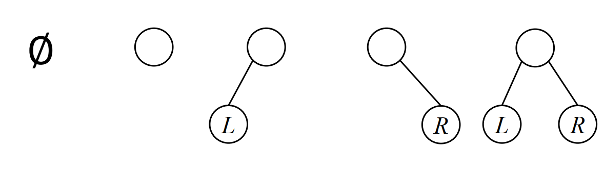

# Tree and Binary tree

## 1. Definition of Tree

A tree is a finite set composed by `n` nodes ($n>0$)

- if $n=0$, empty tree
- if $n>0$,
  - [x] Root node
  - [x] Subtree
    The root of each subtree has and only has one immediate predecessor,while is allowed to have zero or multiple immediate successors.
  - [x] `Successor`/`Predecessors`/`Ancestors`/`Descendants`
  - [x] Degree of node
    number of its subtrees
  - [x] Degree of Tree
    Maximum of nodes' degrees in the tree
  - [x] k-ary tree
    A tree with degree no larger than `k`
  - [x] Child Node
    Immediate successor
  - [x] Parent node
    Immediate predecessor of a node
  - [x] Sibling node
    Nodes with the same parent
  - [x] Level and Depth of node
    
    *Fig1. Show depth and level of Tree*

## 2. Properties of Tree

- [ ] Property 1: The number of nodes in a tree equals the degrees of all nodes plus 1
- [ ] Property 2: If the level of a k-ary tree starts from 1, there are at most $k^{i−1}$ nodes at layer $i$ in a tree（$i\ge 1$）
- [ ] Property 3: A k-ary tree with depth $h$ has at most $\frac{k^h-1}{k-1}$ nodes
- [ ] Property 4: The minimum depth of a k-ary tree with $n$ nodes is 
  $$\lceil\log_k(n\times(k-1)+1)\rceil$$

## 3. Binary Tree

A binary tree is a `𝑘-ary` tree where $k=2$

  
  *Fig2. 5 different forms of binary tree*

### 3.1 Property

- [x] Property 1: If a binary tree has $n_0$ leaves and $n_2$ 2-d nodes, then 
  $$n_0 = n_2 + 1$$
- [x] Property 2: 
