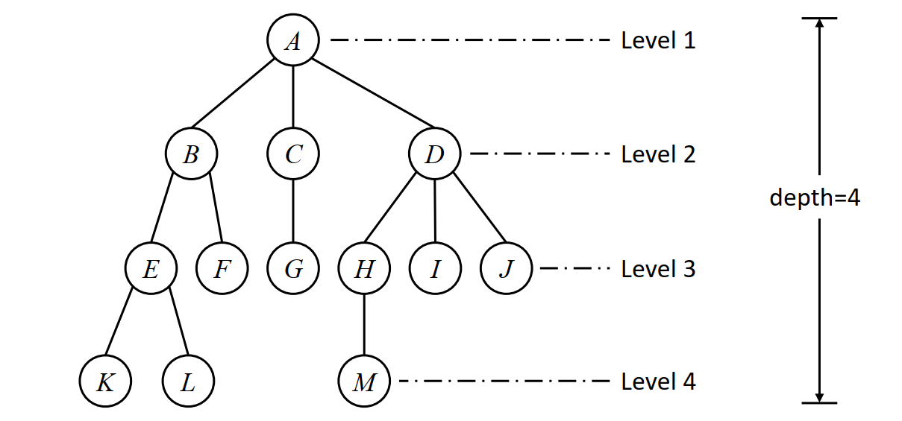
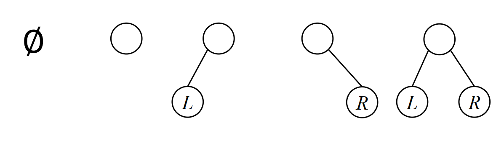
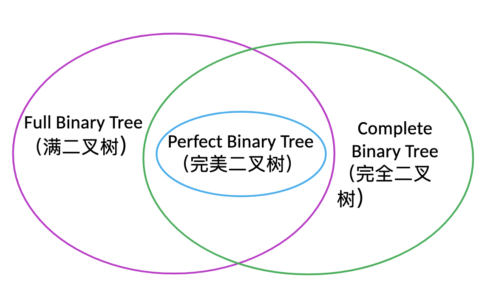
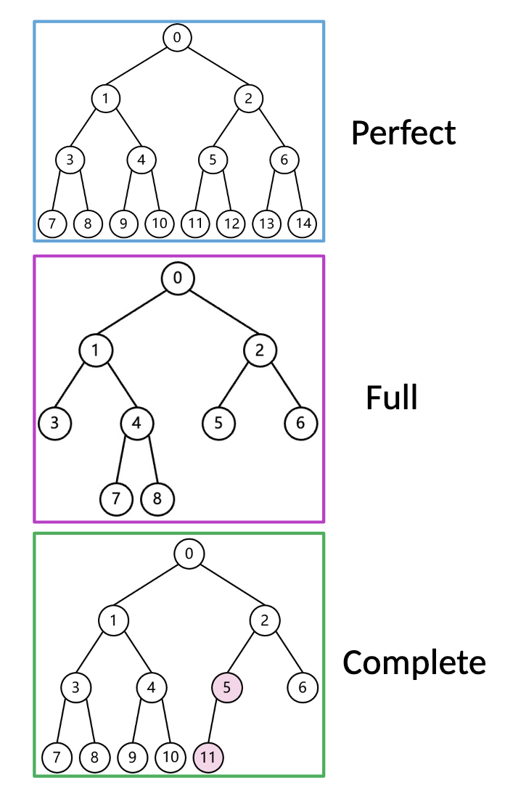
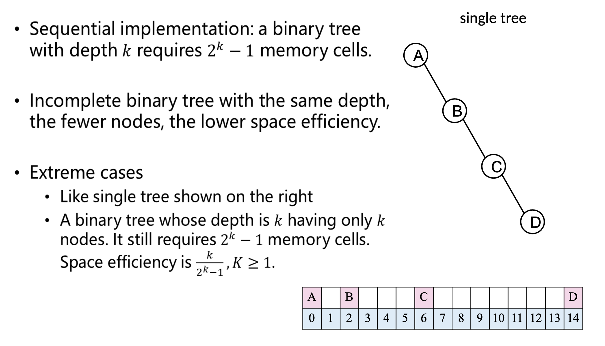
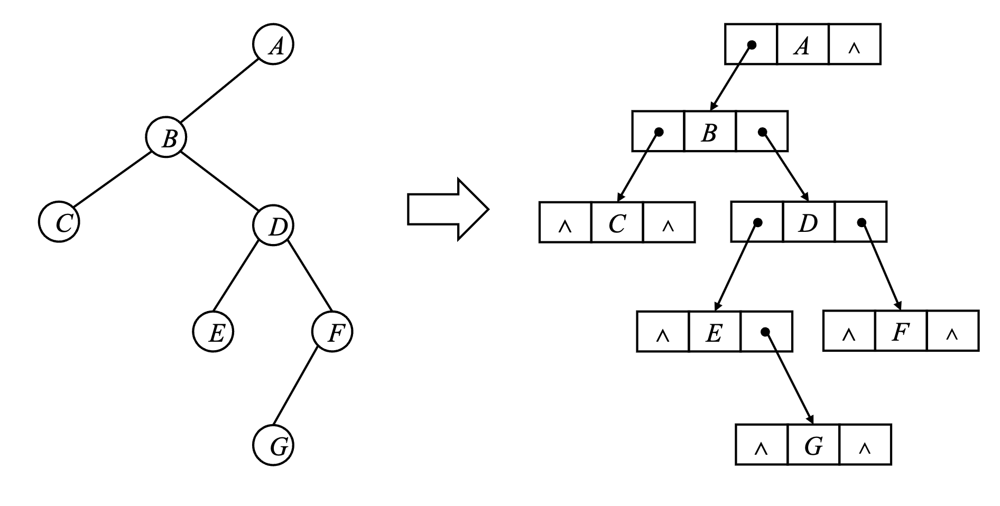
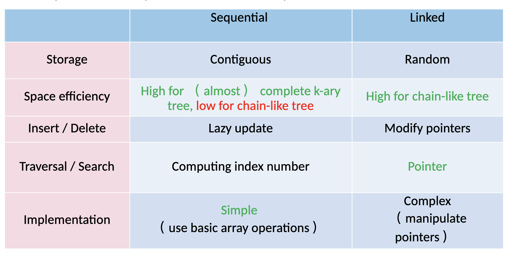

# Tree and Binary tree

## 1. Definition of Tree

A tree is a finite set composed by `n` nodes ($n>0$)

- if $n=0$, empty tree
- if $n>0$,
  - [x] Root node
  - [x] Subtree
    The root of each subtree has and only has one immediate predecessor,while is allowed to have zero or multiple immediate successors.
  - [x] `Successor`/`Predecessors`/`Ancestors`/`Descendants`
  - [x] Degree of node
    number of its subtrees
  - [x] Degree of Tree
    Maximum of nodes' degrees in the tree
  - [x] k-ary tree
    A tree with degree no larger than `k`
  - [x] Child Node
    Immediate successor
  - [x] Parent node
    Immediate predecessor of a node
  - [x] Sibling node
    Nodes with the same parent
  - [x] Level and Depth of node
    
    *Fig1. Show depth and level of Tree*

## 2. Properties of Tree

- [x] Property 1: The number of nodes in a tree equals the degrees of all nodes plus 1
- [x] Property 2: If the level of a k-ary tree starts from 1, there are at most $k^{i−1}$ nodes at layer $i$ in a tree（$i\ge 1$）
- [x] Property 3: A k-ary tree with depth $h$ has at most $\frac{k^h-1}{k-1}$ nodes
- [x] Property 4: The minimum depth of a k-ary tree with $n$ nodes is
  $$\lceil\log_k(n\times(k-1)+1)\rceil$$

## 3. Binary Tree

A binary tree is a `𝑘-ary` tree where $k=2$

  
  *Fig2. 5 different forms of binary tree*

### 3.1 Property

- [x] Property 1: If a binary tree has $n_0$ leaves and $n_2$ 2-d nodes, then
  $$n_0 = n_2 + 1$$
- [x] Property 2: If the level of a binary tree starts from 1, then there are at most $2^{i-1}(i\ge 1)$  nodes in layer i
- [x] Property 3: A binary tree with depth h has at most $2^h-1$ nodes
- [x] Property 4: Depth of a complete binary tree with n nodes is
  $$\lceil \log_2(n+1)\rceil$$
  
  *Fig3*

  
  *Fig4*

- [x] Property 5: Number a complete binary tree with N nodes in the sequence of the top to end and left to right from 0 to $n-1$, the for each node i:
  - if $i=0$, then the node is the root, no `parent`. Or the node $[(i-1)/2]$ is its `parent`
  - if $2i+1\ge n$, then the node has no `left child`; or the node $2i+1$ is its `left child`
  - if $2i+2\ge n$, then the node has no `right child`; or the node $2i+2$ is its `right child`
  - if i is even and $i\neq 0$, then its `left sibling` is $i-1$
  - if i is odd and $i\le n-2$, then its `right sibling` is $i+1$; Or it has no `right sibling`
  - the `level` of i is $[\log_2(i+2)]$

  ## 3.2 Implementation

  - Sequentail implementation: stored as `complete binary tree`

    

  - Linked implementation:

    ```cpp
    typedef struct tnode{
        ElemType data;
        struct tnode *lchild;
        struct tnode *rchild;
    }TreeNode;
    ```

    

  - Comparison

    
