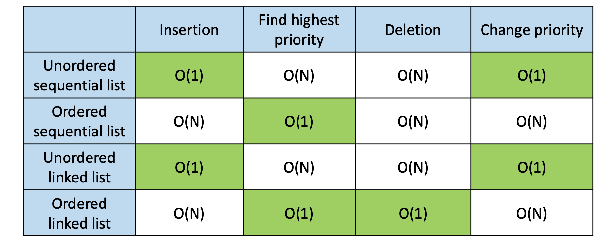
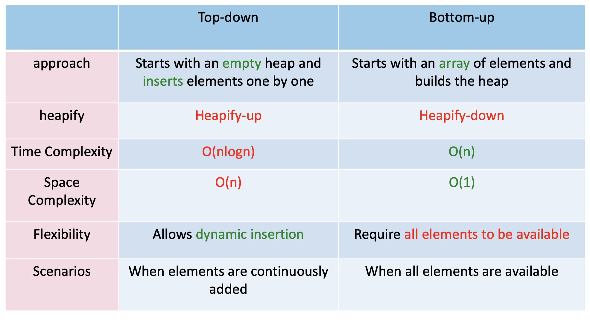

# Priority Queue

## 1. Concept

A priority queue is an abstract data type that operates similarly to a regular queue or stack data structure, but with an added feature: each element has a "priority" associated with it.

In a priority queue, elements **_with higher priority_** are served before elements with lower priority. If two elements have the same priority, they are served according to their order in the queue (typically FIFO - First In, First Out).

## 2. Implementation by Linear List

### 2.1 Code

See [implementation](./LinearListPQ.cpp)

### 2.2 Comparison



## 3. Heap

### 3.1 Concept

A heap is a complete binary tree that satisfies the heap property: Max heap and Min heap.

- **Max heap**: for any given node C, if P is a parent node of C, then the key of P is greater than or equal to the key of C, so top element is the largest.
- **Min heap**: for any given node C, if P is a parent node of C, then the key of P is less than or equal to the key of C, so top element is the smallest.

### 3.2 Common Operations

> The most important operation in a heap is `heapify`, which is used to maintain the heap property after an element has been added or removed.

#### 2 approaches to `heapify`

1. **Top-down approach**: Starting from the root node, compare the node with its children and swap it with the larger (for max heap) or smaller (for min heap) child if necessary. Repeat this process down the tree until the heap property is restored.

   ```cpp
   void CMaxHeap::FixDown(int k){
       int i;
       i = 2*k + 1;
       while(i<heapSize){
           if(i<heapSize-1&&heap[i]<heap[i+1])
           i++；
           if(heap[k]>heap[i]) break;
           exch(heap[k],heap[i]);
           k = i;
           i = 2*k + 1;
       }
   }
   ```

2. **Bottom-up approach**: Starting from the last non-leaf node, compare the node with its children and swap it with the larger (for max heap) or smaller (for min heap) child if necessary. Repeat this process up the tree until the heap property is restored.

   ```cpp
   void CMaxHeap::FixUp(int k){
       int i;
       i = (k-1)/2;
       while(k>0){
           if(heap[i]>=heap[k]) break;
           exch(heap[i],heap[k]);
           k = i;
           i = (k-1)/2;
       }
   }
   ```

### 3.3 Other Operations

- Insertion

  ```cpp
  void CMaxHeap::Insert(ElemType e) {
    heap[heapSize] = e;
    heapSize ++;
    FixUp(heapSize - 1);
  }
  ```

- Deletion

  ```cpp
  ElemType CMaxHeap::Remove( ){
      exch(heap[0], heap[heapSize - 1]);
      heapSize--;
      FixDown(0);
      return heap[heapSize];
  }
  ```

### 3.4 Construction of Heap



### 3.5 Implementation of Priority Queue by Heap

- Get the element with highest priority: return the root element of the heap.

  ```cpp
  void CHeapPQ::getFront(int& e) {
      e = heap[0];
  }
  ```

- Insert an element: add the new element to the end of the heap and then use the `FixUp` operation to maintain the heap property.
