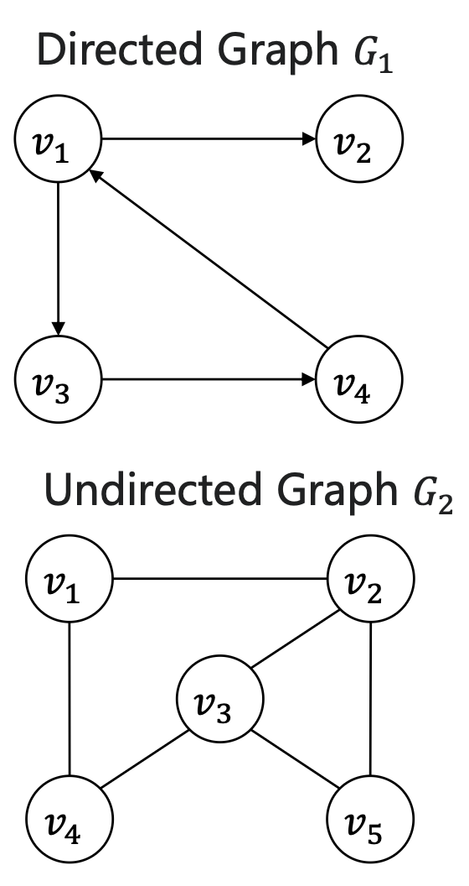
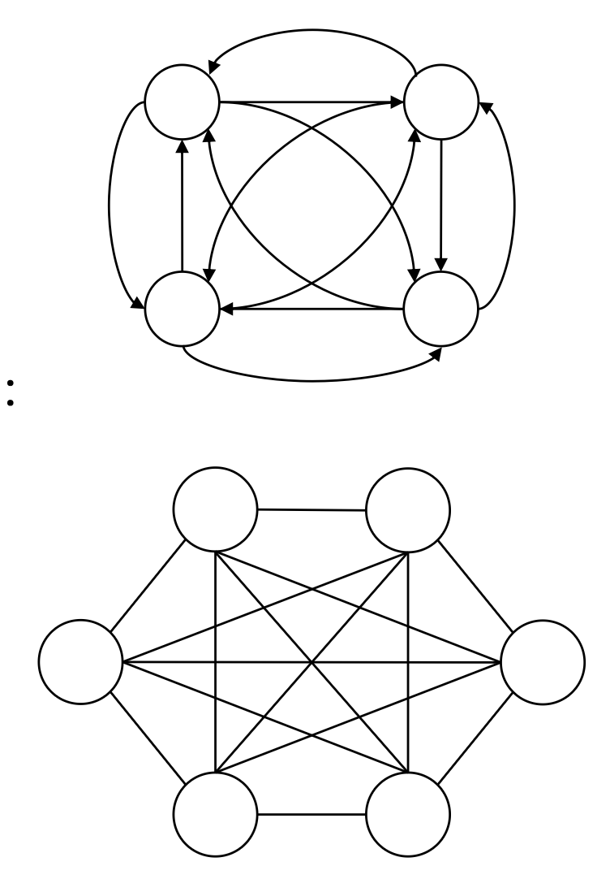

# Graph

## 1. Definition

- Graph is an ordered pair \( G = (V, E) \) comprising a set \( V \) of vertices (or nodes) and a set \( E \) of edges (or links) that connect pairs of vertices. If \< v, w \> is an edge in \( E \), then vertices \( v \) and \( w \) are mutually adjacent or neighbors.

- Directed graphs: $(v,w)\in E$ are odered pairs of vertices. $v$ and $w$ are called head and tail of the directed edge.

  - Complete directed graph:

    $||E||=||V||\times(||V||-1)$

- Undirected graphs: $(v,w)\in E$ are unordered pairs of vertices.

  - Complete undirected graph:

    $||E||=||V||\times(||V||-1)/ 2$

    

    

- Subgraph: A subgraph of a graph $G = (V, E)$ is a graph $G' = (V', E')$ such that $V' \subseteq V$ and $E' \subseteq E$.
- Degree:

  - TD(v): total degree of vertex v
  - ID(v): indegree of vertex v(**_only for directed graph_**)
  - OD(v): outdegree of vertex v(**_only for directed graph_**)

- Handshaking lemma:
  - Undirected graph: $\sum_{v\in V}TD(v)=2||E||$
  - Directed graph: $\sum_{v\in V}ID(v)=\sum_{v\in V}OD(v)=||E||$
- Path: in $G=(V,E)$, a path from vertex $v_0$ to vertex $v_k$ is a sequence of vertices $v_0,v_1,v_2,...,v_k$ such that $(v_{i-1},v_i)\in E$ for $i=1,2,...,k$. The length of the path is $k$ (the number of edges in the path).
  - simple path: no repeated vertices
  - cycle: $v_0=v_k$
  - simple cycle: no repeated vertices except $v_0=v_k$
- Connectivity:
  - connected graph: for every pair of vertices $v$ and $w$, there is a path from $v$ to $w$. (**_undirected graph_**)
  - connected component: a maximal connected subgraph. (**_undirected graph_**)
  - strongly connected: for every pair of vertices $v$ and $w$, there is a path from $v$ to $w$ and a path from $w$ to $v$. (**_directed graph_**)
  - strongly connected component: a maximal strongly connected subgraph. (**_directed graph_**)
  - Eluerian path: a path that uses every edge of the graph exactly once.
  - Eulerian cycle: a cycle that uses every edge of the graph exactly once.
  - Euler's theorem:
    - A connected graph has an Eulerian cycle if and only if every vertex has even degree.
    - A connected graph has an Eulerian path if and only if exactly two vertices have odd
